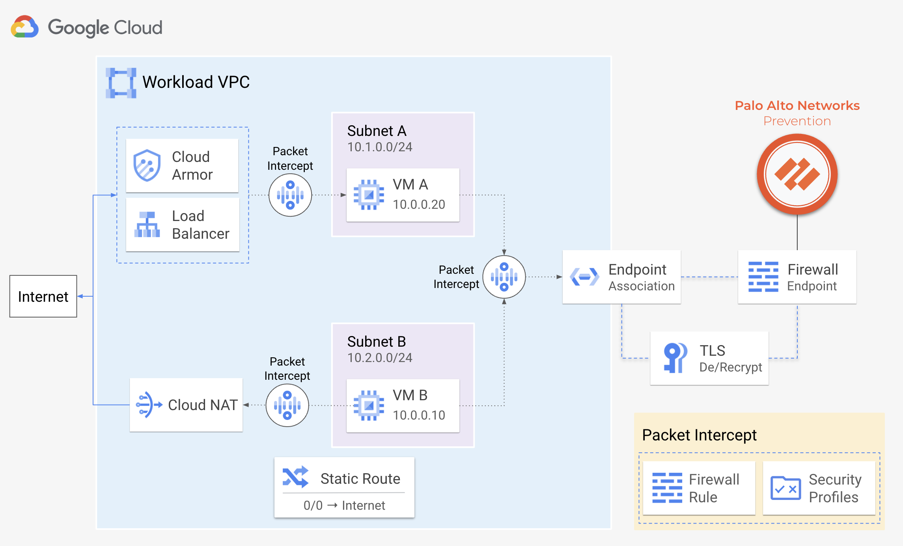

# Google Cloud NGFW Enterprise Tutorial

This tutorial shows how to deploy and prevent threats with [Google Cloud NGFW Enterprise](https://cloud.google.com/security/products/firewall?hl=en), a native Google Cloud service powered by Palo Alto Networks [Threat Prevention](https://docs.paloaltonetworks.com/pan-os/9-1/pan-os-admin/threat-prevention) technologies. 

[Cloud NGFW Enterprise](https://cloud.google.com/firewall?hl=en) is a fully distributed firewall service with advanced protection capabilities to protect your Google Cloud workloads from internal & external threats, including: intrusion, malware, spyware, and command-and-control. The service works by creating Google-managed zonal [firewall endpoints](https://cloud.google.com/firewall/docs/about-firewall-endpoints) that use packet intercept technology to transparently intercept workload traffic for deep packet inspection.



<br>

## Requirements
The following outline the required tools and IAM roles to complete this tutorial

#### Tools

* Access to Google [Cloud Shell](https://cloud.google.com/shell/docs/how-cloud-shell-works), or a local machine with a Terraform or gcloud installation.
* A Google Cloud [project](https://cloud.google.com/resource-manager/docs/creating-managing-projects) to host the deployment.
* A Google Cloud [billing project](https://cloud.google.com/billing/docs/how-to/view-linked).

#### IAM Roles

| Ability                                                                                                            | Level         | Roles        | 
| ------------------------------------------------------------------------------------------------------------------ | ------------- | ------------ |
| Create/modify/view firewall endpoints, endpoint associations, security profiles, and security profile groups.      |  Organization | `compute.networkAdmin`<br>`compute.networkUser`<br>`compute.networkViewer` |
| Create/modify/view global network firewall policies and view effective rules for VPC networks and virtual machines. | Project       | `compute.securityAdmin`<br>`compute.networkAdmin`<br>`compute.networkViewer`<br>`compute.viewer`<br>`compute.instanceAdmin` |

For more information, please see:
* [IAM Roles - Firewall Endpoints](https://cloud.google.com/firewall/docs/about-firewall-endpoints#iam-roles)
* [IAM Roles - Firewall Endpoint Associations](https://cloud.google.com/firewall/docs/about-firewall-endpoints#endpoint-association)
* [IAM Roles - Security Profiles](https://cloud.google.com/firewall/docs/about-security-profiles#iam-roles)
* [IAM Roles - Global Network Firewall Policies](https://cloud.google.com/firewall/docs/network-firewall-policies#iam) 

<br>

## Topology

In this tutorial, a VPC network contains two virtual machines, `client-vm` & `web-vm`. The `client-vm` simulates threats for both north/south internet traffic and east/west traffic to a web application on the `web-vm`.

To prevent the malicious traffic, a Cloud NGFW endpoint is created and associated to the network, where network firewall policies define how the traffic should be inspected by Cloud NGFW.


<br>

## Prepare for Deployment

Enable the required APIs, retrieve the deployment files, and configure the environment variables.

> [!IMPORTANT]
> This tutorial assumes you are using Cloud Shell to provision all resources.

1. Open [Google Cloud Shell](https://shell.cloud.google.com)  and enable the required APIs.

    ```
    gcloud services enable compute.googleapis.com
    gcloud services enable networksecurity.googleapis.com
    gcloud services enable firewallinsights.googleapis.com
    ```

2. Set environment variables for your deployment project and billing project.

    <pre>
    export PROJECT_ID=<b><i>YOUR_PROJECT_ID</i></b>
    export BILLING_ID=<b><i>YOUR_BILLING_PROJECT_ID</i></b></pre>

3. Set environment variables for your deployment region, zone, and naming prefix.

    ```
    export REGION=us-central1
    export ZONE=us-central1-a
    export PREFIX=panw
    ```


4. Select a deployment option.  Both options deploy identical environments. 
    * **[Option 1. Deploy using Terraform](#deploy-using-terraform)**
        - All of the cloud resources required for the tutorial are deployed using a single Terraform plan.
    * **[Option 2. Deploy using gcloud](#deploy-using-gcloud)**
        - Each cloud resource is deployed individually using `gcloud`.  

<br>

## Deploy using Terraform

1. In Cloud Shell, clone the repository and change directories to `/terraform`. 

    ```
    git clone https://github.com/PaloAltoNetworks/google-cloud-ngfw-tutorial
    cd google-cloud-ngfw-tutorial/terraform
    ```

2. Create a `terraform.tfvars` file.

    ```
    cp terraform.tfvars.example terraform.tfvars
    ```

3. Edit the `terraform.tfvars` file and set values for the following variables.

    | Key               | Value                                                   |
    | ----------------- | ------------------------------------------------------- |
    | `org_id`          | The organization ID of your Google Cloud organization.  |
    | `project_id`      | The deployment project ID.                              |
    | `billing_project` | The billing project for your Google Cloud organization. |
    | `region`          | The region for the deployment.                          |
    | `zone`            | The zone with `region` for the cloud resources.         |
    | `prefix`          | A unique string to prepend to the created resources.    |


2.  Initialize and apply the Terraform plan.

    ```
    terraform init
    terraform apply
    ```

    Enter `yes` to create the resources. 

4. Once the Terraform plan completes, proceed to [Prevent Threats with Cloud NGFW](#prevent-threats-with-cloud-ngfw).

<br>

## Deploy using gcloud

1. Create a VPC network, Cloud NAT, and the `client-vm` & `web-vm` virtual machines.

    ```
    gcloud compute networks create $PREFIX-vpc \
        --subnet-mode=custom \
        --project=$PROJECT_ID

    gcloud compute networks subnets create $PREFIX-$REGION-subnet \
        --network=$PREFIX-vpc \
        --range=10.0.0.0/24 \
        --region=$REGION \
        --project=$PROJECT_ID

    gcloud compute routers create $PREFIX-router \
        --network=$PREFIX-vpc \
        --region=$REGION

    gcloud compute routers nats create $PREFIX-nat \
        --router=$PREFIX-router \
        --router-region=$REGION \
        --nat-all-subnet-ip-ranges \
        --auto-allocate-nat-external-ips

    gcloud compute instances create $PREFIX-client-vm \
        --zone=$ZONE \
        --machine-type=f1-micro \
        --image-project=ubuntu-os-cloud \
        --image-family=ubuntu-2004-lts \
        --network-interface subnet=$PREFIX-$REGION-subnet,private-network-ip=10.0.0.10,no-address \
        --project=$PROJECT_ID \
        --metadata=startup-script='#! /bin/bash
        apt-get update
        apt-get install apache2-utils mtr iperf3 tcpdump -y'

    gcloud compute instances create $PREFIX-web-vm \
        --zone=$ZONE \
        --machine-type=f1-micro \
        --image-project=ubuntu-os-cloud \
        --image-family=ubuntu-2004-lts \
        --network-interface subnet=$PREFIX-$REGION-subnet,private-network-ip=10.0.0.20,no-address \
        --project=$PROJECT_ID \
        --metadata=startup-script='#! /bin/bash
        sudo apt-get update
        sudo apt-get install coreutils -y
        sudo apt-get install php -y
        sudo apt-get install apache2 tcpdump iperf3 -y 
        sudo a2ensite default-ssl 
        sudo a2enmod ssl 
        sudo rm -f /var/www/html/index.html
        sudo wget -O /var/www/html/index.php https://raw.githubusercontent.com/wwce/terraform/master/azure/transit_2fw_2spoke_common/scripts/showheaders.php
        sudo systemctl restart apache2'
    ```


4. Create a [Security Profile](https://cloud.google.com/firewall/docs/about-security-profiles) and a [Security Profile Group](https://cloud.google.com/firewall/docs/about-security-profile-groups). 

    ```
    export ORG_ID=$(gcloud projects describe $PROJECT_ID --format=json | jq -r '.parent.id')
    
    gcloud network-security security-profiles threat-prevention create $PREFIX-profile \
        --location=global \
        --project=$PROJECT_ID \
        --organization=$ORG_ID \
        --quiet

    gcloud network-security security-profile-groups create $PREFIX-profile-group \
        --threat-prevention-profile "organizations/$ORG_ID/locations/global/securityProfiles/$PREFIX-profile" \
        --location=global \
        --project=$PROJECT_ID \
        --organization=$ORG_ID \
        --quiet
    ```

    > :bulb: **Information** <br> 
    > A security profile defines the threat prevention profile applied to traffic. A Security profile groups serve as a container for these profiles and are referenced within network firewall policy rules to intercept traffic. 
    <br>


5. Set the default action to `ALERT` for threat severity levels within the security profile.

    ```
    gcloud network-security security-profiles threat-prevention add-override $PREFIX-profile \
        --severities=INFORMATIONAL,LOW,MEDIUM,HIGH,CRITICAL \
        --action=ALERT \
        --location=global \
        --organization=$ORG_ID \
        --project=$PROJECT_ID
    ```

    > :bulb: **Information** <br>
    > Security profiles have predefined actions that are determined by a detected threat's severity level. 
    <br>


8. Create a [Network Firewall Policy](https://cloud.google.com/firewall/docs/network-firewall-policies) with rules that use the security profile group as its action.

    ```
    gcloud compute network-firewall-policies create $PREFIX-policy \
        --global \
        --project=$PROJECT_ID

    gcloud compute network-firewall-policies rules create 10 \
        --firewall-policy=$PREFIX-policy \
        --global-firewall-policy \
        --layer4-configs=tcp:80,tcp:443,tcp:22 \
        --direction=INGRESS \
        --enable-logging \
        --src-ip-ranges=0.0.0.0/0 \
        --dest-ip-ranges=10.0.0.0/24 \
        --action=apply_security_profile_group \
        --security-profile-group=//networksecurity.googleapis.com/organizations/$ORG_ID/locations/global/securityProfileGroups/$PREFIX-profile-group \
        --project=$PROJECT_ID

    gcloud compute network-firewall-policies rules create 11 \
        --firewall-policy=$PREFIX-policy \
        --global-firewall-policy \
        --layer4-configs=all \
        --direction=EGRESS \
        --enable-logging \
        --src-ip-ranges=10.0.0.0/24 \
        --dest-ip-ranges=0.0.0.0/0 \
        --action=apply_security_profile_group \
        --security-profile-group=//networksecurity.googleapis.com/organizations/$ORG_ID/locations/global/securityProfileGroups/$PREFIX-profile-group \
        --project=$PROJECT_ID
    ```


9. Associate the Network Firewall Policy with the VPC network.  

    ```
    gcloud compute network-firewall-policies associations create \
        --firewall-policy=$PREFIX-policy \
        --network=$PREFIX-vpc \
        --name=$PREFIX-policy-association \
        --global-firewall-policy \
        --project=$PROJECT_ID
    ```

    > :bulb: **Information** <br> 
    > A Network Firewall Policy is an organizational resource, enabling you to apply policies across networks within your Google Cloud organization.
    <br>


6. Create a [Cloud NGFW Endpoint](https://cloud.google.com/firewall/docs/about-firewall-endpoints).

    ``` 
    gcloud network-security firewall-endpoints create $PREFIX-endpoint \
        --zone=$ZONE \
        --billing-project=$BILLING_ID \
        --organization=$ORG_ID \
        --quiet

    while true; do
        STATUS_EP=$(gcloud network-security firewall-endpoints describe $PREFIX-endpoint \
            --zone=$ZONE \
            --project=$PROJECT_ID \
            --organization=$ORG_ID \
            --format="json" | jq -r '.state')
        if [[ "$STATUS_EP" == "ACTIVE" ]]; then
            echo "Firewall endpoint $PREFIX-endpoint is now active."
            sleep 30
            break
        fi
        echo "Waiting for the firewall endpoint to be created.  This can take up to 20 minutes..."
        sleep 1
    done
    ```
       
    > :bulb: **Information** <br>
    > A firewall endpoint is a organizational resource which inspects traffic with Palo Alto Networks Threat Prevention technologies.
    <br>

7. Associate the endpoint with the VPC network by creating a [Firewall Endpoint Association](https://cloud.google.com/firewall/docs/configure-firewall-endpoint-associations).

    ```
    gcloud network-security firewall-endpoint-associations create $PREFIX-assoc \
        --endpoint "organizations/$ORG_ID/locations/$ZONE/firewallEndpoints/$PREFIX-endpoint" \
        --network=$PREFIX-vpc \
        --zone=$ZONE \
        --quiet \
        --project=$PROJECT_ID

    while true; do
        STATUS_ASSOC=$(gcloud network-security firewall-endpoint-associations describe $PREFIX-assoc \
            --zone=$ZONE \
            --project=$PROJECT_ID \
            --format="json" | jq -r '.state')

        if [[ "$STATUS_ASSOC" == "ACTIVE" ]]; then
            echo "Endpoint association $PREFIX-assoc is now active."
            sleep 10
            break
        fi
        echo "Waiting for the endpoint association to be created.  This can take up to 10 minutes..."
        sleep 1
    done
    ```

    > :bulb: **Information** <br>
    > The firewall endpoint can be associated with one or more VPC networks within the same zone.
    <br>


10. (Optional) Review the created resources.
    - [Firewall Endpoint](https://console.cloud.google.com/net-security/firewall-endpoints/)
    - [Firewall Endpoint VPC Network Association](https://console.cloud.google.com/networking/networks/list)
    - [Security Profile](https://console.cloud.google.com/net-security/security-profiles/profiles)
    - [Network Firewall Policy](https://console.cloud.google.com/net-security/firewall-manager/firewall-policies/)
    <br>


## Prevent Threats with Cloud NGFW

Verify Cloud NGFW is able to detect threats initiated from the `client-vm` to the internet (north-south) and to the `web-vm` (east-west). Then, modify the security profile to `DENY` traffic containing `MEDIUM`, `HIGH`, & `CRITICAL` threats. 


1. In Cloud Shell, set an environment variable to a script that will generate malicious traffic.

    ```
    REMOTE_SCRIPT='
    ns1=$(curl -s -o /dev/null -w "%{http_code}\n" http://www.eicar.org/cgi-bin/.%2e/.%2e/.%2e/.%2e/bin/sh --data "echo Content-Type: text/plain; echo; uname -a" --max-time 2)
    ns2=$(curl -s -o /dev/null -w "%{http_code}\n" http://www.eicar.org/cgi-bin/user.sh -H "FakeHeader:() { :; }; echo Content-Type: text/html; echo ; /bin/uname -a" --max-time 2)
    ns3=$(curl -s -o /dev/null -w "%{http_code}\n" http://www.eicar.org/cgi-bin/.%2e/.%2e/.%2e/.%2e/etc/passwd --max-time 2)
    ew1=$(curl -w "%{http_code}\\n" -s -o /dev/null http://10.0.0.20/cgi-bin/.%2e/.%2e/.%2e/.%2e/bin/sh --data "echo Content-Type: text/plain; echo; uname -a" --max-time 2)
    ew2=$(curl -w "%{http_code}\\n" -s -o /dev/null http://10.0.0.20/cgi-bin/user.sh -H "FakeHeader:() { :; }; echo Content-Type: text/html; echo ; /bin/uname -a" --max-time 2) 
    ew3=$(curl -w "%{http_code}\\n" -s -o /dev/null http://10.0.0.20/cgi-bin/.%2e/.%2e/.%2e/.%2e/etc/passwd --max-time 2)
    echo ""
    echo "Response Codes (north/south) :  $ns1 $ns2 $ns3"
    echo "Response Codes (east/west)   :  $ew1 $ew2 $ew3"
    echo ""'
    ```
    <br>

2. Execute remote script on the `client-vm` to simulate malicious internet and east-west traffic to the `web-vm`.

    ```
    gcloud compute ssh $PREFIX-client-vm --zone=$ZONE --tunnel-through-iap --command="bash -c '$REMOTE_SCRIPT'"
    ```

    <pre><i>(output)</i><br><br><b>Response Codes (north/south) :  400 301 400<br>Response Codes (east/west)   :  400 404 400</b></pre>

    > :bulb: **Information** <br>
    > The threats from the `client-vm` return successful response codes.  This is because the security profile is set to `ALERT` on all detected threats. 
    <br>


3. Update the security profile to `DENY` traffic containing  `MEDIUM`, `HIGH`, & `CRITICAL` threats.
    
    ```
    gcloud network-security security-profiles threat-prevention update-override $PREFIX-profile \
        --severities=MEDIUM,HIGH,CRITICAL \
        --action=DENY \
        --location=global \
        --organization=$ORG_ID \
        --project=$PROJECT_ID

    for i in {0..119}; do
        remaining_seconds=$((600 - i * 5))
        echo "Waiting for the changes to propagate... $((remaining_seconds / 60)) minutes $((remaining_seconds % 60)) seconds remaining."
        sleep 5
    done
    echo "Good job. 10 minutes have passed."
    ```
    > :bulb: **Information** <br>
    > It takes ~10 minutes for the security profile to propagate through the Cloud NGFW endpoints. 
    <br>

4. Re-run the remote script on the `client-vm` to simulate malicious internet and east-west traffic again. 

    ```
    gcloud compute ssh $PREFIX-client-vm --zone=$ZONE --tunnel-through-iap --command="bash -c '$REMOTE_SCRIPT'"
    ```

    <pre><i>(output)</i><br><br><b>Response Codes (north/south) :  000 000 000<br>Response Codes (east/west)   :  000 000 000</b></pre>

    > :bulb: **Information** <br>
    > The malicious traffic from the `client-vm` return failed response codes. This is because the security profile is set to `DENY` on `MEDIUM-CRITICAL` threats.
    <br>


4. In the Google Cloud console, go to **[Network Security → Threats](https://console.cloud.google.com/net-security/threats/)** to view the threat logs.

    


> [!NOTE]
> At first, the logs show Cloud NGFW alerted on the detected threats. After modifying the security profile, the logs should then show Cloud NGFW blocking traffic with `MEDIUM`, `HIGH`, and `CRITICAL` threats.
<br>


## (Optional) Configure TLS Inspection 

Cloud NGFW can decrypt and inspect TLS traffic by using short-lived intermediate certificates generated through [Certificate Authority Service](https://cloud.google.com/certificate-authority-service/docs/ca-service-overview) (CAS).  After inspection, the traffic is re-encrypted before sending it to its intended destination. 


For more information, see [TLS Inspection](https://cloud.google.com/firewall/docs/about-tls-inspection#:~:text=Cloud%20NGFW%20decrypts%20the%20TLS,sending%20it%20to%20its%20destination).


### Configure CAS and create a Trust Config
Create a CA pool and a root CA within CAS. Then, create a service account to manage certificates within your CA pool along with a [trust config](https://cloud.google.com/certificate-manager/docs/how-it-works#trust-configs) to generate server certificates.

1. Enable the required APIs.

    ```
    gcloud services enable privateca.googleapis.com
    gcloud services enable certificatemanager.googleapis.com
    ```
1. Create CA pool and a root CA certificate within CAS. 

    ```
    gcloud privateca pools create $PREFIX-ca-pool \
        --project=$PROJECT_ID \
        --location=$REGION \
        --tier=enterprise
    
    gcloud privateca roots create $PREFIX-ca-root \
        --project=$PROJECT_ID \
        --location=$REGION \
        --pool=$PREFIX-ca-pool \
        --subject="CN=NGFW Enterprise Test CA 2, O=Google NGFW Enterprise Test" \
        --auto-enable
    ```

2. Create a service account to generate certificates within your CA pool.

    ```
    gcloud beta services identity create \
        --service=networksecurity.googleapis.com \
        --project=$PROJECT_ID

    export PROJECT_NUMBER=$(gcloud projects describe $PROJECT_ID --format="get(projectNumber)")

    gcloud privateca pools add-iam-policy-binding $PREFIX-ca-pool \
        --project=$PROJECT_ID \
        --location=$REGION \
        --role=roles/privateca.certificateRequester \
        --member=serviceAccount:service-$PROJECT_NUMBER@gcp-sa-networksecurity.iam.gserviceaccount.com
    ```

3.  Create a file (`trust_config.yaml`) to represent your trust config, using your root CA as the trust anchor.

    ```
    export NGFW_ROOT_CA=$(gcloud privateca roots describe $PREFIX-ca-root \
        --project=$PROJECT_ID \
        --pool=$PREFIX-ca-pool \
        --location=$REGION \
        --format="value(pemCaCertificates)" | sed 's/^/ /')

    printf "name: '$PREFIX-trust-config'\ntrustStores:\n- trustAnchors:\n    - pemCertificate: |\n%s\n" "$(echo "$NGFW_ROOT_CA" | sed 's/^/        /')" > trust_config.yaml
    ```

6. Import the `trust_config.yaml` into into Certificate Manager. 

    ```
    gcloud certificate-manager trust-configs import $PREFIX-trust-config \
        --project=$PROJECT_ID \
        --location=$REGION \
        --source=trust_config.yaml
    ```

> [!CAUTION]
> If the import fails, verify your `trust_config.yaml` is indented as follows:
> ```yaml
> name: 'panw-trust-config'
> trustStores:
> - trustAnchors:
>    - pemCertificate: |
>         -----BEGIN CERTIFICATE-----
>         MIIFhTC3A22gAwIBAgIUASvM1sh
>         ...
>         gADX9iK6YUp2jenA6VL5J+afw==
>         -----END CERTIFICATE-----
> ```
<br>


### Configure TLS Inspection Policy

Create a [TLS Inspection Policy](https://cloud.google.com/firewall/docs/about-tls-inspection) and attach it to your firewall endpoint association to intercept TLS traffic.  Then, update your `INGRESS` and `EGRESS` network firewall rules to decrypt traffic.

1. Create a manifest file (`tls_policy.yaml`) to define the TLS inspection policy.

    ```
    cat > tls_policy.yaml << EOF 
    description: Test tls inspection policy. 
    name: projects/$PROJECT_ID/locations/$REGION/tlsInspectionPolicies/$PREFIX-tls-policy 
    caPool: projects/$PROJECT_ID/locations/$REGION/caPools/$PREFIX-ca-pool 
    excludePublicCaSet: false 
    minTlsVersion: TLS_1_1 
    tlsFeatureProfile: PROFILE_COMPATIBLE 
    trustConfig: projects/$PROJECT_ID/locations/$REGION/trustConfigs/$PREFIX-trust-config 
    EOF
    ```

2. Import the `tls_policy.yaml` to create the TLS inspection policy. 

    ```
    gcloud network-security tls-inspection-policies import $PREFIX-tls-policy \
        --project=$PROJECT_ID \
        --location=$REGION \
        --source=tls_policy.yaml
    ```

3. Update the firewall endpoint association with your VPC network to use the TLS inspection policy. 

    ```
    gcloud network-security firewall-endpoint-associations update $PREFIX-assoc \
        --zone=$ZONE \
        --project=$PROJECT_ID \
        --tls-inspection-policy=$PREFIX-tls-policy \
        --tls-inspection-policy-project=$PROJECT_ID \
        --tls-inspection-policy-region=$REGION 
    ```

4. Update the `INGRESS` and `EGRESS` network firewall rules to decrypt TLS traffic.

    ```
    gcloud compute network-firewall-policies rules update 10 \
        --firewall-policy=$PREFIX-policy \
        --global-firewall-policy \
        --tls-inspect

    gcloud compute network-firewall-policies rules update 11 \
        --firewall-policy=$PREFIX-policy \
        --global-firewall-policy \
        --tls-inspect
    ```
    
    > :bulb: **Information** <br> 
    > The `--tls-inspect` flag enables TLS decryption for traffic matching the firewall rule.  When traffic hits this rule, Cloud NGFW generates a new server certificate for the matched TLS traffic. 
    <br>


### Import Certificates to Virtual Machines

Upload the root CA to the `client-vm` to enable TLS inspection for egress traffic.  Then, within CAS, create a server certificate and upload it to the `web-vm` to enable TLS inspection for the web application.

##### Client VM

1. Write the root CA certificate to a file named `local_ca_root.crt`.

    ```
    gcloud privateca roots describe $PREFIX-ca-root \
        --project=$PROJECT_ID \
        --location=$REGION \
        --pool=$PREFIX-ca-pool \
        --format="value(pemCaCertificates)" >> local_ca_root.crt
    ```

2. Upload the `local_ca_root.crt` to the `client-vm`.
    
    ```
    gcloud compute scp local_ca_root.crt --tunnel-through-iap $PREFIX-client-vm:~/ --zone=$ZONE
    ```

3. Update the trust store on the `client-vm` to use the new certificate.
    
    ```
    gcloud compute ssh $PREFIX-client-vm --zone=$ZONE --tunnel-through-iap --command="bash -s" <<EOF
    sudo mv local_ca_root.crt /usr/local/share/ca-certificates/ 
    sudo update-ca-certificates
    EOF
    ```

##### Web VM

1. Create server certificate (`server.pem`) and key (`key.pem`) for the web app on `web-vm`.

    ```
    export WEB_VM_IP=$(gcloud compute instances describe $PREFIX-web-vm --project=$PROJECT_ID --zone=$ZONE --format='get(networkInterfaces[0].networkIP)')

    gcloud privateca certificates create \
        --issuer-location=$REGION \
        --issuer-pool $PREFIX-ca-pool \
        --subject "CN=Cloud NGFW Enterprise,O=Google" \
        --ip-san=$WEB_VM_IP \
        --generate-key \
        --key-output-file=./key.pem \
        --cert-output-file=./server.pem
    ```

2. Transfer the server certificate to the `web-vm`. 

    ```
    gcloud compute scp --tunnel-through-iap server.pem $PREFIX-web-vm:~/ --zone=$ZONE
    gcloud compute scp --tunnel-through-iap key.pem $PREFIX-web-vm:~/ --zone=$ZONE
    ```

3. On the `web-vm`, update the web application's SSL configuration to use the server certificate.

    ```
    gcloud compute ssh $PREFIX-web-vm --zone=$ZONE --tunnel-through-iap --command="bash -s" <<EOF
    sudo mv server.pem /etc/ssl/certs/
    sudo mv key.pem /etc/ssl/private/
    sudo sed -i 's/ssl-cert-snakeoil.pem/server.pem/g' /etc/apache2/sites-available/default-ssl.conf
    sudo sed -i 's/ssl-cert-snakeoil.key/key.pem/g' /etc/apache2/sites-available/default-ssl.conf
    sudo systemctl restart apache2
    sudo systemctl status apache2
    EOF
    ```
    <br>


### Prevent TLS Encrypted Threats with Cloud NGFW
Verify Cloud NGFW is able to intercept, decrypt, and inspect TLS traffic from the `client-vm` and `web-vm`.

1. Set an environment variable to a script that will generate malicious TLS traffic.

    ```
    REMOTE_SCRIPT_TLS='
    ns1=$(curl -s -o /dev/null -w "%{http_code}\n" https://www.eicar.org/cgi-bin/.%2e/.%2e/.%2e/.%2e/bin/sh --data "echo Content-Type: text/plain; echo; uname -a" --max-time 2)
    ns2=$(curl -s -o /dev/null -w "%{http_code}\n" https://www.eicar.org/cgi-bin/user.sh -H "FakeHeader:() { :; }; echo Content-Type: text/html; echo ; /bin/uname -a" --max-time 2)
    ns3=$(curl -s -o /dev/null -w "%{http_code}\n" https://www.eicar.org/cgi-bin/.%2e/.%2e/.%2e/.%2e/etc/passwd --max-time 2)
    ew1=$(curl -w "%{http_code}\\n" -s -o /dev/null https://10.0.0.20/cgi-bin/.%2e/.%2e/.%2e/.%2e/bin/sh --data "echo Content-Type: text/plain; echo; uname -a" --max-time 2)
    ew2=$(curl -w "%{http_code}\\n" -s -o /dev/null https://10.0.0.20/cgi-bin/user.sh -H "FakeHeader:() { :; }; echo Content-Type: text/html; echo ; /bin/uname -a" --max-time 2) 
    ew3=$(curl -w "%{http_code}\\n" -s -o /dev/null https://10.0.0.20/cgi-bin/.%2e/.%2e/.%2e/.%2e/etc/passwd --max-time 2)
    echo ""
    echo "Response Codes (north/south) :  $ns1 $ns2 $ns3"
    echo "Response Codes (east/west)   :  $ew1 $ew2 $ew3"
    echo ""'
    ```


2. Execute the script remotely on the `client-vm` to simulate threats for outbound internet traffic and east-west traffic to the `web-vm`.

    ```
    gcloud compute ssh $PREFIX-client-vm --zone=$ZONE --tunnel-through-iap --command="bash -c '$REMOTE_SCRIPT_TLS'"
    ```

    <pre><i>(output)</i><br><br><b>Response Codes (north/south) :  000 000 000<br>Response Codes (east/west)   :  000 000 000</b></pre>

    > :bulb: **Information** <br> 
    > Each curl should result in a `000` response code indicating Cloud NGFW has decrypted, inspected, and blocked the pseudo-malicious traffic. 
    <br>


4. In the Google Cloud console, go to **[Network Security → Threats](https://console.cloud.google.com/net-security/threats/)** to view the threat logs.

    
    <br>

> [!WARNING]
> If the threats using `tcp:443` do not appear, please wait several minutes and re-run the `REMOTE_SCRIPT_TLS` from the `client-vm` again. 

> [!NOTE] 
> You should see the actions taken by the firewall endpoint, indicating the service has detected and/or stopped the threats encrypted within TLS.
<br>


## Delete Environment

To delete the created resources, delete your Google Cloud deployment project.  If you cannot delete your project, follow the steps below to delete the cloud resources created in this tutorial.

### Delete using Terraform

1. In Cloud Shell, destroy the resources created within the Terraform plan.

    ```
    cd
    cd google-cloud-ngfw-tutorial/terraform
    terraform destroy
    ```

    Enter `yes` to destroy the resources. 

2. If you configured TLS inspection, delete the CAS resources. 

    ```
    cd ..
    delete_tls.sh
    ```
    
### Delete using gcloud

1. Clone the repository to Cloud Shell. 

    ```
    git clone https://github.com/PaloAltoNetworks/google-cloud-ngfw-tutorial
    cd google-cloud-ngfw-tutorial
    ```

2. Execute the script to delete the resources created in the tutorial.

    ```
    delete_tutorial.sh
    ```

3. If you configured TLS inspection, delete the CAS resources used to decrypt TLS traffic. 

    ```
    delete_tls.sh
    ```


## More Information

Please see the materials below for more information about the topics discussed in this tutorial.

* [Announcement Palo Alto Networks with Google Cloud NGFW Enterprise](https://www.paloaltonetworks.com/blog/network-security/netsec-google-cloud-firewall-plus/)
* [Palo Alto Networks with Google Cloud](https://cloud.google.com/palo-alto-networks)
* [Cloud NGFW Enterprise Overview](https://cloud.google.com/firewall/docs/about-intrusion-prevention)
* [Configure Intrusion Prevention Service](https://cloud.google.com/firewall/docs/configure-intrusion-prevention)
